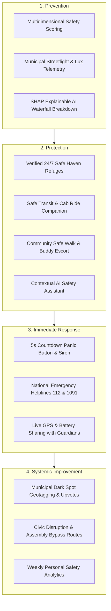

# SafeRoute AI — Smart & Safe Navigation Platform for Nighttime Mobility

> **An AI-powered personal safety and navigation prototype engineered for women, solo commuters, students, and night-shift workers. Features multidimensional safety route scoring, Explainable AI (SHAP) feature attribution, in-house vector cartography, and multi-tier emergency response escalation.**

---

## Table of Contents

- [1. Overview](#1-overview)
- [2. Problem Statement](#2-problem-statement)
- [3. Proposed Solution](#3-proposed-solution)
- [4. Features](#4-features)
  - [A. Core Route Intelligence & Explainability](#a-core-route-intelligence--explainability)
  - [B. Live Navigation & Anomaly Rerouting](#b-live-navigation--anomaly-rerouting)
  - [C. Emergency Response & Safe Refuges](#c-emergency-response--safe-refuges)
  - [D. Transit, Infrastructure & Community Network](#d-transit-infrastructure--community-network)
  - [E. Hardware Bezel Emulator & Developer Toolbar](#e-hardware-bezel-emulator--developer-toolbar)
- [5. Technologies / Tech Stack Used](#5-technologies--tech-stack-used)
- [6. Installation & Setup Instructions](#6-installation--setup-instructions)
- [7. How to Run the Project](#7-how-to-run-the-project)
  - [Available Scripts](#available-scripts)
  - [Troubleshooting](#troubleshooting)
- [8. Project Structure](#8-project-structure)
- [9. Screenshots / Demo Views](#9-screenshots--demo-views)
- [10. Team Members](#10-team-members)
- [11. Future Scope / Enhancements](#11-future-scope--enhancements)
- [12. Working Source Code of the Prototype](#12-working-source-code-of-the-prototype)
- [13. Testing and Validation](#13-testing-and-validation)
- [14. Limitations](#14-limitations)
- [15. Additional Documentation](#15-additional-documentation)
- [16. Safety and Data Disclaimer](#16-safety-and-data-disclaimer)

---

## 1. Overview

**SafeRoute AI** is an interactive, mobile-first web prototype created to demonstrate how modern navigation platforms can prioritize **personal safety and well-lit pedestrian corridors** rather than optimizing solely for shortest distance or vehicular speed.

Built with **React 19, TypeScript, Tailwind CSS v4, and Motion**, the application features:
- A custom **in-house SVG vector map engine** (`MapEngine.tsx`) that renders realistic urban city morphology, waterways, parks, road casing hierarchies, and active navigation routes without external paid API keys.
- A **19-screen mobile experience** running inside an interactive hardware emulator (`MobileFrame.tsx`) with instant Phone-to-Fluid switching.
- **Explainable AI (SHAP Waterfall Attribution)** illustrating the positive and negative parameters contributing to a route's safety index.
- A **deterministic navigation lifecycle state machine** with active GPS simulation, live lux illumination telemetry, and arrival confirmation.
- Comprehensive safety workflows including **Safe Havens (24/7 pharmacies, police kiosks)**, **Transit Disruption & Gathering Hubs**, **Streetlight Infrastructure Reporting**, and **Community Safe Walk Escorts**.

---

## 2. Problem Statement

Commercial navigation applications (such as Google Maps, Apple Maps, and Waze) are fundamentally engineered for vehicular traffic throughput and shortest physical distance. When applied to solo pedestrians—particularly women walking home at night, university students traversing campus perimeters, or healthcare workers on late-night shifts—traditional routing algorithms introduce serious safety hazards:

1. **Routing Through Dark Spots:** The algorithm directs pedestrians through poorly lit shortcuts, unmonitored back-alleys, or desolate industrial zones simply because they save 90 seconds.
2. **The "Black Box" Trust Problem:** When an app labels a route "safe", users have no insight into *why* it is safe, what parameters were evaluated, or whether lighting and emergency help points exist.
3. **Lack of Dynamic Hazard Awareness:** Traditional maps do not proactively alert pedestrians when municipal streetlights are non-functional, when unexpected civic assembly blockades close metro gates, or when a cab deviates from an approved route.
4. **Delayed Emergency Response:** Standard emergency calling requires unlocking a phone, finding an emergency dialer, and describing location coordinates under extreme duress.

SafeRoute AI addresses these challenges through a cohesive, proactive personal safety ecosystem.

---

## 3. Proposed Solution

SafeRoute AI structures its response across four foundational pillars:



1. **Prevention:** Evaluates routes across weighted factors (Lux illumination, crowd density, CCTV surveillance, police proximity) and presents an explicit, transparent safety score with SHAP attribution.
2. **Protection:** Integrates verified safe havens (Apollo 24/7 pharmacies, police desks) directly into the navigation map, paired with transit telemetry and community walk companions.
3. **Immediate Response:** Multi-tier emergency escalation featuring discreet triggers, automated guardian GPS dispatch, and one-tap emergency helpline hotlinks (112, 1091).
4. **Systemic Improvement:** Closes the municipal loop by enabling citizens to report broken streetlights and track NDMC/PWD resolution progress.

---

## 4. Features

The prototype implements **19 full screens and interactive modals**, categorized into 5 functional modules:

### A. Core Route Intelligence & Explainability
- **Home Dashboard (`DashboardScreen.tsx`):** Central safety status center featuring a dynamic 94% Safety Index badge, night mode indicators, emergency SOS trigger, quick action cards, and localized safety widgets.
- **Route Search (`RouteSearchScreen.tsx`):** Origin/destination search with multi-parameter safety filters (Well-Lit Paths, Open Metro Stations, Avoid Dark Zones, CCTV Monitored).
- **Route Comparison (`RouteComparisonScreen.tsx`):** Side-by-side comparative analysis of multiple evaluated paths:
  - *Route A (Shortest Distance):* 4.2 km • 12 min • 58% Safety Index (Poor lighting, low activity).
  - *Route B (Moderate Balance):* 4.8 km • 15 min • 79% Safety Index (Average commercial street lighting).
  - *Route C (Recommended Safe Route):* 5.3 km • 17 min • 93% Safety Index (96% illumination, CCTV coverage, metro proximity).
- **SHAP Explainability (`ShapExplainabilityScreen.tsx`):** Interactive Explainable AI (XAI) waterfall chart breaking down exact feature weights:
  - `+35 pts`: Smart street illumination (Lux sensor uptime)
  - `+22 pts`: Crowd activity & verified storefront footfall
  - `+15 pts`: Proximity to Central Metro Line CCTV concourse
  - `+8 pts`: Active police kiosk coverage
  - `-12 pts`: Penalty for recent isolated incident report

### B. Live Navigation & Anomaly Rerouting
- **Live Navigation HUD (`LiveNavigationScreen.tsx`):** Turn-by-turn guidance with simulated walk progression, step-by-step safety notes, real-time lux illumination gauge (e.g. 98 Lux), and unified right-hand control rail (Recenter, Layer toggle, Audio, Pause/Resume, 30s Check-In, Alert simulation).
- **Navigation Lifecycle State Machine:** Explicit transitions between `navigating`, `paused`, and `completed`.
- **Terminal Arrival Experience:** Automatic arrival confirmation at 100% progress, setting remaining distance/time to zero, stopping simulation timers, and displaying verified journey summary statistics.
- **Interactive Progress Scrubbing:** Clickable linear progress bar allowing instant testing of any point along the route timeline.
- **Safety Alert Simulation (`SafetyAlertModal.tsx`):** Real-time simulated hazard pop-up triggered by sudden sensor illumination drop or corridor obstruction.
- **Dynamic Rerouting (`DynamicReroutingScreen.tsx`):** Side-by-side detour comparison contrasting the compromised corridor against an optimized safe bypass corridor (+2 min delta, +18% safety gain).

### C. Emergency Response & Safe Refuges
- **Emergency SOS Hub (`EmergencySosScreen.tsx`):** 5-second countdown panic button, emergency audio siren simulation, automated GPS coordinate transmission to trusted guardians, and 1-tap links to National Emergency Helplines (112 Police, 1091 Women Safety).
- **Safety Check-In (`SafetyCheckInScreen.tsx`):** 30-second automated countdown prompt ("Are you safe?") with single-tap "I Am Safe" confirmation or direct SOS escalation.
- **Verified Safe Haven Directory (`SafeHavenNetworkScreen.tsx`):** Interactive map and directory of 24/7 verified civilian safe havens:
  - Apollo 24/7 Pharmacies (first-aid, phone charging)
  - Delhi Police All-Women Helpdesks
  - Campus Security Command Posts
  - Direct telephone dialing and 1-tap detour routing into the nearest haven.

### D. Transit, Infrastructure & Community Network
- **Public Gathering & Disruption Hub (`PublicGatheringHubScreen.tsx`):** Neutral, civic-aware monitoring of public assemblies, metro gate closures (Rajiv Chowk Gate 2 closed, Janpath open), and Emergency Green Medical Corridors with Route D bypass selection.
- **Transit Companion (`TransportCompanionScreen.tsx`):** Public transit and ride-hail monitoring system: vehicle license plate logger (`DL 01 RT 4829`), driver verification badge, route deviation alarms (>150m off route), and prolonged stationary stop alerts (>3 min).
- **Streetlight & Infrastructure Reporting (`InfrastructureReportingScreen.tsx`):** Municipal civic accountability hub enabling commuters to geotag dark spots, non-functional streetlights, and broken walkways, complete with community upvotes (+1) and civic tracking (`Reported` ➔ `Assigned PWD/NDMC` ➔ `Resolved`).
- **Community Safe Walk (`CommunitySafeWalkScreen.tsx`):** Peer-to-peer and campus safety network enabling solo walkers to request verified campus wardens or buddy escorts between metro stations and hostels.
- **Trusted Contacts (`TrustedContactsScreen.tsx`):** Guardian management interface displaying live location-sharing status and phone battery indicators.
- **Safety Analytics (`SafetyAnalyticsScreen.tsx`):** Personal mobility safety dashboard displaying weekly trip histories, day-by-day safety ratings, and hourly risk trends between 8 PM and 1 AM.
- **Profile & Settings (`ProfileSettingsScreen.tsx`):** User preferences for night mode, high-contrast monochrome themes, alert sensitivity, offline map caches, and language selection.

### E. Hardware Bezel Emulator & Developer Toolbar
- **Interactive Mobile Bezel (`MobileFrame.tsx`):** Realistic iPhone silhouette (`390 x 844` portrait aspect ratio) featuring Dynamic Island, hardware bezel, status bar, and home indicator.
- **Device Mode Switching:** Instant toggle between **Phone Mode** (centered smartphone bezel) and **Fluid Mode** (full-viewport preview container) without layout bouncing or font distortion.
- **Prototype Screen Navigator:** Top dropdown menu and arrow controls to switch between all 19 screens instantly during evaluation.
- **Event Simulation Buttons:** Hardware bezel shortcuts to simulate real-time safety alerts and 30-second safety check-in countdowns.
- **Embedded AI Safety Copilot (`FloatingAiAssistant.tsx`):** Contextual assistant drawer offering quick prompt chips ("Explain my 93% SHAP score", "Is Grand Blvd safe right now?", "Nearest 24/7 safe haven?") with responsive intent parsing.
- **Theme & Language Toggles:** High-contrast Light/Dark mode switcher and multilingual selector (English, Hindi, Spanish, French).

---

## 5. Technologies / Tech Stack Used

| Category | Technology | Version | Purpose in SafeRoute AI |
| :--- | :--- | :--- | :--- |
| **Core Framework** | React | `^19.0.1` | Component architecture, state orchestration, screen dispatching |
| **Language** | TypeScript | `~5.8.2` | Strict type safety, route and telemetry interfaces (`types.ts`) |
| **Build Tool & Dev Server** | Vite | `^6.2.3` | Hot module replacement, lightning-fast compilation, bundle optimization |
| **Styling Framework** | Tailwind CSS | `^4.1.14` | Modern CSS-in-JS utility styling, `@custom-variant dark`, responsive tokens |
| **Animation & Physics** | Motion (`motion/react`) | `^12.23.24` | Screen transitions, spring physics, accessible `useReducedMotion` |
| **Vector Cartography** | Custom SVG Vector Engine | In-house (`MapEngine.tsx`) | Custom vector street grid, waterways, parks, route lines, GPS puck |
| **Iconography** | Lucide React | `^0.546.0` | High-contrast accessible navigation and status icons |
| **State & Context** | React Context API | Native | `ThemeContext` (Monochrome mode), `LanguageContext` (i18n) |
| **Explainable AI (XAI)** | SHAP Attribution Model | Native (`mockData.ts`) | Feature-importance breakdown of safety parameters |
| **Runtime / Typing Tools** | `tsx`, `@types/node` | `^4.21.0` | Automated standalone state-machine testing and development scripts |
| **AI Integration Package** | `@google/genai` | `^2.4.0` | Installed SDK dependency for cloud Gemini API integrations |

> **Note on Map & AI Architecture:**  
> - SafeRoute AI **does not** depend on paid external map services (Google Maps API, Mapbox, Leaflet, or MapLibre). The cartography is an **in-house SVG vector engine** that runs completely offline with deterministic route interpolation.
> - While `@google/genai` is included in `package.json` for server-side Gemini integration, the current client prototype's AI assistant (`FloatingAiAssistant.tsx`) operates offline using responsive prompt-matching intent parsing for instant, deterministic demonstration.

---

## 6. Installation & Setup Instructions

### Prerequisites
- **Node.js:** Version `18.0.0` or higher (`Node.js 20+ LTS` recommended)
- **npm:** Version `9.0.0` or higher
- **Git**

### Step-by-Step Setup

1. **Clone the repository:**
   ```bash
   git clone https://github.com/deshkarswanandi9-cell/Safepath-AI-2.git
   cd Safepath-AI-2
   ```

2. **Install project dependencies:**
   ```bash
   npm install
   ```

3. **Configure Environment Variables (Optional):**  
   The prototype is fully configured to run offline out-of-the-box with seed data and does not strictly require an environment file for local testing. If integrating with Google Gemini AI Studio, copy `.env.example`:
   ```bash
   cp .env.example .env
   ```
   Edit `.env` to configure your optional keys:
   ```env
   GEMINI_API_KEY="YOUR_GEMINI_API_KEY"
   APP_URL="http://localhost:3000"
   ```

---

## 7. How to Run the Project

### Available Scripts

| Command | Action | Output / Target |
| :--- | :--- | :--- |
| `npm run dev` | Starts the Vite development server with HMR | `http://localhost:3000` |
| `npm run lint` | Runs TypeScript static verification (`tsc --noEmit`) | Verifies zero compilation errors |
| `npm run build` | Compiles and optimizes production assets | Bundles assets into `dist/` |
| `npm run preview` | Serves the production build locally | `http://localhost:4173` |

### Starting the Development Server
```bash
npm run dev
```
Open your browser and navigate to:
```
http://localhost:3000
```

### Troubleshooting Common Issues

- **Port Conflict (`EADDRINUSE: 3000`):** Vite will automatically attempt the next available port (e.g. `3001`). You can also specify an explicit port:
  ```bash
  npx vite --port=3005
  ```
- **Stale Cache / Build Artifacts:** Run the clean command before rebuilding:
  ```bash
  rm -rf dist node_modules/.vite
  npm run build
  ```
- **Missing Node Types:** If your IDE flags `path` or `process` in `vite.config.ts`, verify that `npm install` completed successfully so that `@types/node` is linked.

---

## 8. Project Structure

```
Safepath-AI-2/
├── .env.example               # Environment template for Gemini API & applet URL
├── .gitignore                 # Excludes node_modules, dist, local caches
├── CONTRIBUTING.md            # Developer contribution guidelines & PR workflow
├── index.html                 # HTML entry point, Google Fonts, inline theme script
├── metadata.json              # Project identity & capability metadata
├── package.json               # Dependencies, scripts, and package manifests
├── package-lock.json          # Deterministic dependency lockfile
├── ROADMAP.md                 # 4-Pillar product roadmap & feature specifications
├── tsconfig.json              # TypeScript compiler configuration (ESNext, Bundler)
├── vite.config.ts             # Vite configuration with Tailwind CSS v4 & React plugin
│
├── docs/                      # Supplementary technical documentation
│   └── ARCHITECTURE.md        # Comprehensive system architecture & data flow
│
└── src/                       # Application source code
    ├── App.tsx                # Screen dispatcher, global state & SOS orchestrator
    ├── main.tsx               # React 19 DOM root mounting
    ├── index.css              # Tailwind CSS v4 entry point & monochrome variables
    ├── types.ts               # Domain types: ScreenId, RouteOption, NavStep, etc.
    │
    ├── components/            # Reusable UI & infrastructure components
    │   ├── BottomNavBar.tsx   # 5-tab primary navigation bar
    │   ├── FloatingAiAssistant.tsx # Embedded AI Safety Copilot with prompt chips
    │   ├── MapEngine.tsx      # In-house SVG vector cartography engine
    │   ├── MobileFrame.tsx    # Hardware bezel emulator & screen switcher toolbar
    │   │
    │   ├── screens/           # 19 Screen implementations
    │   │   ├── SplashScreen.tsx
    │   │   ├── LoginScreen.tsx
    │   │   ├── DashboardScreen.tsx
    │   │   ├── RouteSearchScreen.tsx
    │   │   ├── RouteComparisonScreen.tsx
    │   │   ├── ShapExplainabilityScreen.tsx
    │   │   ├── LiveNavigationScreen.tsx
    │   │   ├── SafetyAlertModal.tsx
    │   │   ├── DynamicReroutingScreen.tsx
    │   │   ├── SafetyCheckInScreen.tsx
    │   │   ├── EmergencySosScreen.tsx
    │   │   ├── TrustedContactsScreen.tsx
    │   │   ├── SafetyAnalyticsScreen.tsx
    │   │   ├── ProfileSettingsScreen.tsx
    │   │   ├── PublicGatheringHubScreen.tsx
    │   │   ├── SafeHavenNetworkScreen.tsx
    │   │   ├── TransportCompanionScreen.tsx
    │   │   ├── InfrastructureReportingScreen.tsx
    │   │   └── CommunitySafeWalkScreen.tsx
    │   │
    │   └── ui/                # High-contrast monochrome atomic design system
    │       ├── Badge.tsx      # Semantic status badges (Safe, Caution, Alert)
    │       ├── Button.tsx     # High-contrast action buttons
    │       ├── Card.tsx       # Surface cards with subtle borders
    │       ├── Input.tsx      # Form input fields with focus rings
    │       └── Switch.tsx     # Accessible toggles
    │
    ├── context/               # Global state providers
    │   ├── LanguageContext.tsx# Multilingual localization provider (EN, HI, ES, FR)
    │   └── ThemeContext.tsx   # Pure Light / Pure Dark monochrome theme provider
    │
    ├── data/                  # Seed datasets & dictionaries
    │   ├── mockData.ts        # Routes, SHAP factors, POIs, nav steps, zones
    │   └── translations.ts    # Multilingual translation dictionary
    │
    └── utils/                 # Utilities & animation tokens
        └── motion.ts          # Transition tokens, spring presets, reduced motion
```

---

## 9. Screenshots / Demo Views

> **Visual Assets Note:**  
> The repository utilizes programmatic SVG vector cartography and responsive styling rather than static image files. The table below lists the 19 core views available in the interactive prototype for documentation capture:

| # | Screen / Module | Primary Visual Components |
| :---: | :--- | :--- |
| **01** | **Splash Screen** | Branded header, core safety pillars, Get Started CTA |
| **02** | **Login & Auth** | Mobile number input, simulated OTP verification, guardian setup |
| **03** | **Home Dashboard** | 94% Safety Index badge, night status, SOS button, quick action grid |
| **04** | **Route Search** | Origin/destination inputs, safety criteria filter toggles |
| **05** | **Route Comparison** | Evaluated corridors (Routes A, B, C) with interactive map preview |
| **06** | **SHAP Explainability** | XAI waterfall chart attributing positive/negative safety weights |
| **07** | **Live Navigation** | SVG map HUD, turn guidance, lux meter, progress bar, arrival card |
| **08** | **Safety Alert Modal** | High-contrast emergency dialog for sudden corridor dark spots |
| **09** | **Dynamic Rerouting** | Side-by-side detour comparison contrasting old vs. safe path |
| **10** | **Safety Check-In** | 30s countdown timer with "I Am Safe" acknowledgment |
| **11** | **Emergency SOS** | 5s panic trigger, audio siren toggle, 112 & 1091 helpline hotlinks |
| **12** | **Trusted Contacts** | Guardian list, real-time battery status, location sharing toggles |
| **13** | **Safety Analytics** | Weekly safety rating graphs, 8 PM - 1 AM hourly safety trends |
| **14** | **Profile & Settings** | High-contrast monochrome toggles, alert sensitivity, language selection |
| **15** | **Public Gathering Hub** | Civic assembly monitor, metro gate closures, Green Medical Corridor |
| **16** | **Safe Haven Network** | 24/7 verified refuge directory (police desks, pharmacies, campus posts) |
| **17** | **Transit Companion** | Cab ride telemetry: plate logger, deviation & abnormal stop alarms |
| **18** | **Infrastructure Reporting** | Dark spot geotagging, community upvotes, municipal PWD tracker |
| **19** | **Community Safe Walk** | Peer walking escort requests, background-checked campus wardens |

---

## 10. Team Members

| Name | Role | GitHub Profile |
| :--- | :--- | :--- |
| `[Add Team Member 1 Name]` | `[e.g., Lead Frontend Engineer]` | `[GitHub Profile]` |
| `[Add Team Member 2 Name]` | `[e.g., AI / XAI Research Engineer]` | `[GitHub Profile]` |
| `[Add Team Member 3 Name]` | `[e.g., Product Designer & Cartographer]` | `[GitHub Profile]` |

*Note: The official team roster and contributor full names are not specified in the repository metadata. Contributors can update this table with verified full names, roles, and institutional affiliations.*

---

## 11. Future Scope / Enhancements

1. **Real-World Geographic Integrations:** Incorporate OpenStreetMap (OSM) tile layers and real-world vector routing (Valhalla / OSRM) while maintaining offline fallback capability.
2. **Municipal IoT Sensor Streaming:** Connect directly to live city municipal smart pole APIs for real-time street light lux telemetry and operational uptime.
3. **Live Geolocation & Background Pings:** Implement native Progressive Web App (PWA) service workers with Web Geolocation Watchers for continuous background navigation.
4. **Backend Infrastructure & Persistence:** Build a production backend (Node.js/Express, PostgreSQL + PostGIS) for persistent user accounts, encrypted contact lists, and municipal report tickets.
5. **Production SOS Telephony Integration:** Connect emergency SOS triggers to SMS/voice gateways (Twilio / Exotel) to send automated location SMS messages and initiate real calls to verified guardians.
6. **Federated & Privacy-Preserving Analytics:** Implement local on-device differential privacy for incident reporting to ensure commuter anonymity.

---

## 12. Working Source Code of the Prototype

All source code required to inspect, build, and run the working prototype is tracked directly in this repository:

- **Application Entry Point:** [`src/main.tsx`](file:///d:/Safepath-AI-2/src/main.tsx) mounts the root React application into `index.html`.
- **Root Screen Orchestrator:** [`src/App.tsx`](file:///d:/Safepath-AI-2/src/App.tsx) manages screen navigation state, modal overlays, and emergency SOS triggers.
- **Hardware Bezel Shell:** [`src/components/MobileFrame.tsx`](file:///d:/Safepath-AI-2/src/components/MobileFrame.tsx) wraps the app in a realistic phone shell with developer navigation controls.
- **Vector Cartographic Engine:** [`src/components/MapEngine.tsx`](file:///d:/Safepath-AI-2/src/components/MapEngine.tsx) renders the city map, roads, waterways, safe havens, and navigation paths.
- **Navigation Lifecycle Engine:** [`src/components/screens/LiveNavigationScreen.tsx`](file:///d:/Safepath-AI-2/src/components/screens/LiveNavigationScreen.tsx) manages trip simulation, turn-by-turn steps, and arrival states.

---

## 13. Testing and Validation

The codebase has undergone static code analysis and production build verification:

### 1. Static TypeScript Verification
```bash
npx tsc --noEmit
# Result: 0 errors (Exit code 0)
```

### 2. Production Bundle Compilation
```bash
npm run build
# Result: Vite v6.2.3 built production client bundle into dist/ (Exit code 0)
```

### 3. Navigation Lifecycle Unit Verification
The navigation state machine, step index synchronization, metric calculations, and arrival transitions were validated via automated assertions:
- **Step Calculation:** Step 0 (`0%`) ➔ Step 1 (`20%`) ➔ Step 2 (`45%`) ➔ Step 3 (`65%`) ➔ Step 4 (`85%`) ➔ Final arrival step (`100%`).
- **Metric Scaling:** Remaining distance and time scale proportionally with progress, resolving to strictly `0 m` and `0 min` at 100%.
- **Map Alignment:** Progress at 100% mathematically matches destination pin coordinates `(440, 75)`.
- **Interval Management:** Timers halt on pause, resume on play, and cleanly terminate upon journey completion.

---

## 14. Limitations

- **Simulated Navigation:** Walk progress, speed, and GPS location are simulated locally using timers; live device GPS hardware tracking is not currently activated.
- **Local Mock Data:** Route paths, SHAP feature values, streetlight lux levels, and incident reports are pre-configured seed structures (`src/data/mockData.ts`) rather than live municipal server feeds.
- **Client-Side AI Copilot:** The AI safety assistant uses client-side keyword and intent parsing for offline predictability rather than live cloud LLM inference.
- **Demonstration Emergency Dispatch:** The Emergency SOS screen simulates guardian SMS and siren alerts; it does not automatically dispatch police or contact emergency services in real life.

---

## 15. Additional Documentation

- [**System Architecture (`docs/ARCHITECTURE.md`)**](docs/ARCHITECTURE.md): Detailed architectural walkthrough, state machines, SVG cartography, and data models.
- [**Contributing Guide (`CONTRIBUTING.md`)**](CONTRIBUTING.md): Code standards, monochrome styling rules, branch conventions, and PR checklist.
- [**Product Roadmap (`ROADMAP.md`)**](ROADMAP.md): Comprehensive feature roadmap, ethical principles, and public intelligence specs.
- [**Environment Configuration (`.env.example`)**](.env.example): Template for optional AI Studio and deployment environment variables.

---

## 16. Safety and Data Disclaimer

> **IMPORTANT NOTICE:**  
> SafeRoute AI is an experimental software prototype developed for demonstration and hackathon evaluation purposes. It utilizes simulated navigation data, pre-configured safety indices, and demonstration emergency triggers.  
>  
> **This application does not guarantee personal safety, prevent crime, or substitute for official government emergency services.**  
> In an actual emergency situation, always immediately contact official national emergency authorities directly:  
> - **National Emergency Number (India):** `112`  
> - **Women Safety Helpline:** `1091`  
> - **Local Police Emergency Service:** Contact your local jurisdiction.
