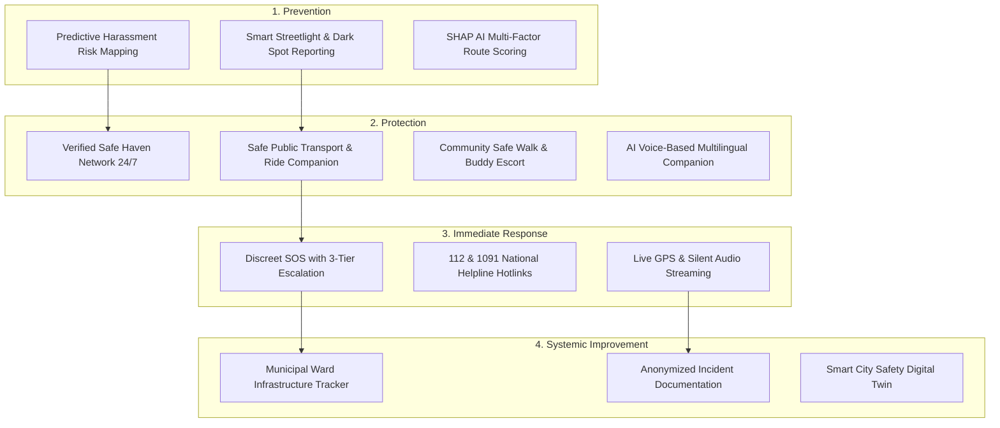

# 🛡️ SafePath AI 2.0 — Women's Safety Ecosystem & Adaptive Public Intelligence

> **A Comprehensive Women's Safety, Prevention, Protection, and Response Platform**  
> SafeRoute AI (SafePath AI 2.0) empowers solo commuters, women, students, and journalists with proactive risk prevention, safe haven networks, public transport companion monitoring, smart multi-tier SOS escalation, and community infrastructure accountability.

---

## 🏛️ The 4 Pillars of SafeRoute AI

---

## 🚀 Key Feature Breakdown

### 1. 🏥 Verified Safe Haven Network
- **24/7 Protected Refuges**: Apollo pharmacies, Delhi Police all-women helpdesks, campus security command posts, and verified late-night cafes.
- **Verification Badges**: Female Staff on Duty, 24/7 CCTV Monitored, Direct Police Link, Phone Charging Stations.
- **Direct Navigation & Calling**: One-tap emergency call and route diversion into the nearest verified safe haven.

### 2. 🚗 Safe Public Transport & Cab Companion
- **Ride Telemetry Tracking**: Logs vehicle plate (`DL 01 RT 4829`), driver verified rating, and live coordinates.
- **Route Deviation Alarms**: Instant alert if a vehicle deviates >150m from the approved route into isolated areas.
- **Prolonged Stationary Stop Alarms**: Detects abnormal stops (>3 mins) without traffic chokepoints.

### 3. 🚨 Smart SOS with Multi-Tier Emergency Escalation
- **Discreet Emergency Triggers**: Shake gesture, volume button shortcut, or floating SOS radar.
- **3-Tier Escalation Protocol**:
  - **Tier 1**: Immediate SMS & GPS coordinate transmission to Primary Guardians.
  - **Tier 2**: Automatic escalation to Campus Security & Local Safe Walker (if unacknowledged within 35s).
  - **Tier 3**: National Police Dispatch 112 & 1091 Women Safety Helpline hotlink.

### 4. 💡 Smart Streetlight & Municipal Infrastructure Reporting Hub
- **Dark Spot Geotagging**: Report non-functional streetlights, unlit bus stops, obstructed CCTV, or broken footpaths.
- **Municipal Accountability**: Real-time resolution status (`Reported` ➔ `Assigned to NDMC/PWD` ➔ `Work in Progress` ➔ `Resolved`).
- **Community Upvotes (+1)**: Corroborate hazardous dark spots to prioritize municipal maintenance.

### 5. 👥 Community Safe Walk & Verified Buddy Network
- **Late-Night Escort Requests**: Request in-person walking accompaniment between metro stations, campus hostels, and bus stops.
- **Verified Wardens**: Background-checked campus security wardens and student safety volunteers.

### 6. 🎙️ AI Voice-Based Multilingual Safety Companion
- **Hands-Free Voice Guidance**: Voice check-ins and spoken safety alerts in English, Hindi (हिंदी), and Marathi (मराठी).

---

## 🚀 Key Feature Specifications

### 1. 👥 Public Gathering & Protest Aware Mode
- **Adaptive Rerouting**: Dynamically detects civic gatherings, assemblies, or perimeter blockades and routes around congested segments.
- **Unbiased Design**: Evaluates physical accessibility, lux illumination, and crowd density without labeling peaceful civic activity as inherently dangerous.
- **Dynamic Bypass (Route D)**: Automated calculation of high-illumination detour avenues avoiding closed intersections.

### 2. 🚇 Live Metro & Public Transport Disruption Tracker
- **Gate-by-Gate Intelligence**: Real-time tracking of gate closures (e.g., Rajiv Chowk Gate 2 closed, Janpath Gate 4 open).
- **Alternative Station Suggestions**: Suggests nearest unhindered transit hub with walking time deltas.

### 3. 📈 15–30 Minute Predictive Crowd Surge Forecaster
- **Pre-emptive Forecasting**: Predicts upcoming density surges before bottlenecks develop based on event dispersal patterns and transit peak waves.
- **SHAP Weight Attribution**: Transparently explains *why* risk is increasing (`+45% Dispersal Wave`, `-12% Marshals Directing Flow`).

### 4. 🏥 Emergency Medical Green Corridors & AI Safe Exits
- **Medical Access Priority**: Identifies and prioritizes open hospital access lanes (e.g., RML / Trauma Centre direct ramps).
- **Safe Evacuation Pathfinder**: Instantly routes users to the nearest verified unobstructed civilian exit or emergency shelter.

### 5. 📴 Offline Emergency Resilience & Journalist Mode
- **Local Map & Contact Caching**: Full navigation instructions and emergency contact details stored locally in browser/device storage.
- **Journalist / Solo High-Security Mode**: Automated discrete GPS ping every 2 minutes with dead-man safety check-in triggers.

### 6. ✅ Verified Community Safety Network
- **Multi-Tiered Verification**: Categorizes reports into *Official Police/Transit Advisory*, *Corroborated Community (+1)*, and *Unverified Submissions*.
- **Auto-Expiry**: Temporary notices expire automatically within 30–90 minutes unless re-confirmed.

---

## 🔒 Privacy, Safety & Ethical Principles

1. **No Facial Recognition or Tracking**: The application strictly avoids biometric surveillance or identification of participants in gatherings.
2. **Access & Freedom of Movement**: Recommendations help commuters make informed safety choices without artificially restricting lawful public mobility.
3. **Data Minimization**: Location telemetry is processed ephemerally on-device or encrypted in transit for emergency guardian dispatch only.

---

## 💻 Technical Architecture

| Component | Implementation Stack |
| :--- | :--- |
| **Frontend Framework** | React 19 + TypeScript + Vite 6 |
| **Styling & Motion** | Tailwind CSS v4 + Motion (`framer-motion`) |
| **Map Visualization** | Custom Interactive SVG Vector Engine (`MapEngine.tsx`) |
| **AI Explainability & Copilot** | Google Gemini API (`@google/genai`) + SHAP Factor Scoring |
| **Localization (i18n)** | `LanguageContext` supporting English, Hindi (हिंदी), and Marathi (मराठी) |
