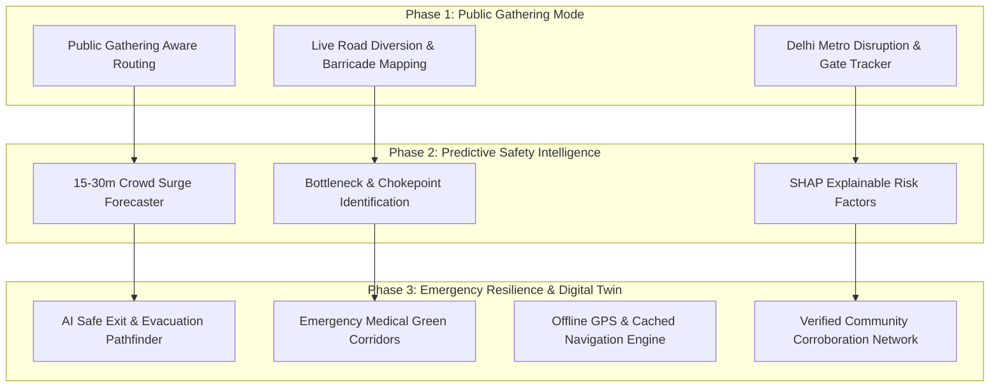

# 🛡️ SafePath AI 2.0 — Public-Gathering Safety & Adaptive Intelligence Roadmap

> **Innovative Feature Proposals & Development Roadmap for SafePath AI 2.0 / SafeRoute AI**  
> Prepared for adaptive public safety intelligence, transit disruption management, and crowd surge risk prediction.

---

## 📌 Executive Summary
**SafeRoute AI (SafePath AI 2.0)** is an intelligent, safety-first personal navigation and commuting companion. While the core system already provides multi-factor lighting, crowd density, CCTV corridors, SHAP-based explainability, and live emergency response, this roadmap extends the platform into **Adaptive Public Safety Intelligence**.

The system empowers solo commuters, women, students, and journalists to navigate safely through changing conditions around public assemblies, rallies, civic gatherings, road closures, and transport bottlenecks—while strictly preserving civil privacy, individual liberty, and access to essential emergency services.

---

## 🏗️ 3-Phase Core Roadmap

---

## 🚀 Key Feature Specifications

### 1. 👥 Public Gathering & Protest Aware Mode
- **Adaptive Rerouting**: Dynamically detects civic gatherings, assemblies, or perimeter blockades and routes around congested segments.
- **Unbiased Design**: Evaluates physical accessibility, lux illumination, and crowd density without labeling peaceful civic activity as inherently dangerous.
- **Dynamic Bypass (Route D)**: Automated calculation of high-illumination detour avenues avoiding closed intersections.

### 2. 🚇 Live Metro & Public Transport Disruption Tracker
- **Gate-by-Gate Intelligence**: Real-time tracking of gate closures (e.g., Rajiv Chowk Gate 2 closed, Janpath Gate 4 open).
- **Alternative Station Suggestions**: Suggests nearest unhindered transit hub with walking time deltas.

### 3. 📈 15–30 Minute Predictive Crowd Surge Forecaster
- **Pre-emptive Forecasting**: Predicts upcoming density surges before bottlenecks develop based on event dispersal patterns and transit peak waves.
- **SHAP Weight Attribution**: Transparently explains *why* risk is increasing (`+45% Dispersal Wave`, `-12% Marshals Directing Flow`).

### 4. 🏥 Emergency Medical Green Corridors & AI Safe Exits
- **Medical Access Priority**: Identifies and prioritizes open hospital access lanes (e.g., RML / Trauma Centre direct ramps).
- **Safe Evacuation Pathfinder**: Instantly routes users to the nearest verified unobstructed civilian exit or emergency shelter.

### 5. 📴 Offline Emergency Resilience & Journalist Mode
- **Local Map & Contact Caching**: Full navigation instructions and emergency contact details stored locally in browser/device storage.
- **Journalist / Solo High-Security Mode**: Automated discrete GPS ping every 2 minutes with dead-man safety check-in triggers.

### 6. ✅ Verified Community Safety Network
- **Multi-Tiered Verification**: Categorizes reports into *Official Police/Transit Advisory*, *Corroborated Community (+1)*, and *Unverified Submissions*.
- **Auto-Expiry**: Temporary notices expire automatically within 30–90 minutes unless re-confirmed.

---

## 🔒 Privacy, Safety & Ethical Principles

1. **No Facial Recognition or Tracking**: The application strictly avoids biometric surveillance or identification of participants in gatherings.
2. **Access & Freedom of Movement**: Recommendations help commuters make informed safety choices without artificially restricting lawful public mobility.
3. **Data Minimization**: Location telemetry is processed ephemerally on-device or encrypted in transit for emergency guardian dispatch only.

---

## 💻 Technical Architecture

| Component | Implementation Stack |
| :--- | :--- |
| **Frontend Framework** | React 19 + TypeScript + Vite 6 |
| **Styling & Motion** | Tailwind CSS v4 + Motion (`framer-motion`) |
| **Map Visualization** | Custom Interactive SVG Vector Engine (`MapEngine.tsx`) |
| **AI Explainability & Copilot** | Google Gemini API (`@google/genai`) + SHAP Factor Scoring |
| **Localization (i18n)** | `LanguageContext` supporting English, Hindi (हिंदी), and Marathi (मराठी) |
